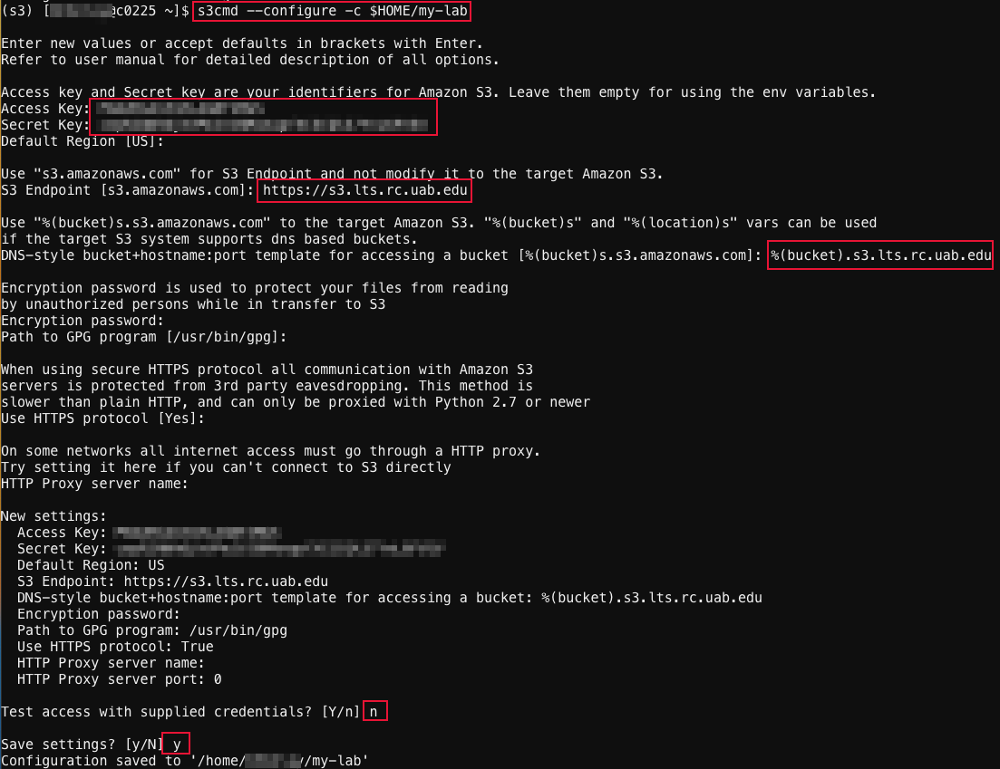

# Basic Workflow with shared LTS and s3cmd

This tutorial is intended for PIs, Core Directors, as well as their managers and stewards, who are responsible for managing shared LTS allocations for their Lab or Core. While the installation of `s3cmd` is the same as covered in [our individual LTS tutorial](./individual_lts_tutorial.md#install-s3cmd-within-conda-environment-on-cheaha), this tutorial focuses on configuring and using s3cmd for shared LTS allocations—especially when you manage both individual and shared LTS.

We’ll walk through how to configure access for a shared LTS, switch between your individual and shared LTS allocations, and perform key operations such as creating and managing buckets and objects. We'll also show you how to set up and manage read and write access for other allocations to your shared LTS buckets and objects.

## Prerequisites

To follow this tutorial effectively, you should have a basic understanding of the [prerequisites covered in our individual LTS tutorial](individual_lts_tutorial.md#prerequisites). In addition, you should have a shared LTS allocation already created by our team either with you as the owner or designated as a manager or steward for your Lab's or Core's shared LTS allocation.

## Configuring s3cmd for Shared LTS Buckets

Once you have `s3cmd` installed and your environment activated as done for in [our individual LTS tutorial](./individual_lts_tutorial.md#install-s3cmd-within-conda-environment-on-cheaha), you can begin the configuration process using the following command:

`s3cmd --configure -c $HOME/<lts-profile-name>`

In the same way, you can configure multiple LTS profiles if you own or manage more than one LTS allocation. Just use the corresponding access and secret keys, and replace `<lts-profile-name>` with an appropriate name for each profile. During configuration, you will be prompted to enter additional details, which will appear on screen as show below.

Once the configuration is complete, `s3cmd` will generate a file in your home directory `$HOME` using the profile name you provided. For example, if you name your shared LTS profile `abc-lab`, the configuration file will be saved as a$ `HOME/abc-lab`. This will be in addition to the default `.s3cfg` file that was previously configured for your individual LTS, as shown below.

## Creating  Shared LTS Buckets

## Managing Shared LTS Buckets

## How to Grant Access to Other Allocations for your shred LTS Buckets?
